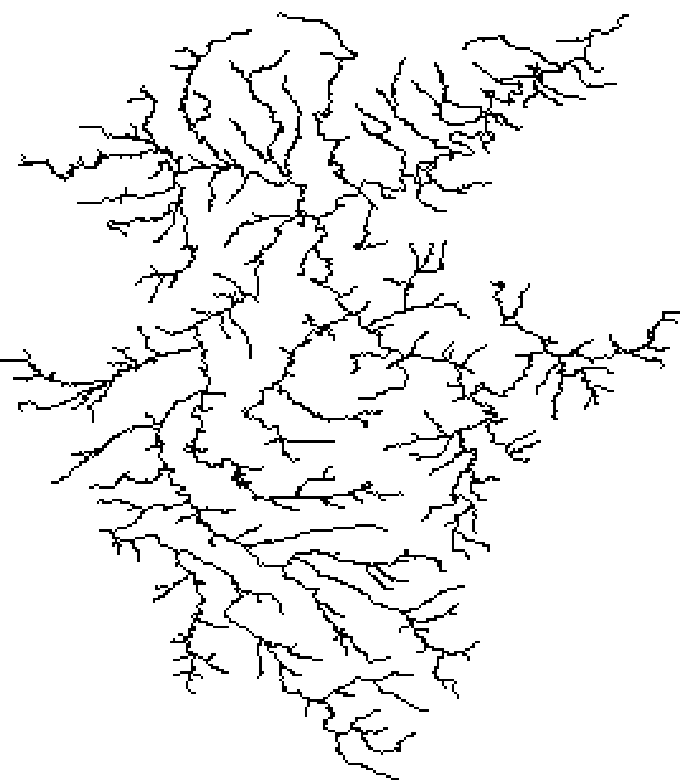
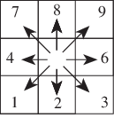

# Wflow

This details my experiments in getting Wflow running in New Zealand, both for
calibrated catchments and nationally.

Wflow.jl [repo](https://github.com/Deltares/Wflow.jl) and their [doco](https://deltares.github.io/Wflow.jl/stable/)

## Installing Wflow and/or Julia

You can either install the binary
[wflow_cli](https://download.deltares.nl/en/wflow)
or if you want to stay keep up with latest, modify code, or write scripts about wflow package,
start by installing Julia.

On linux
```
curl -fsSL https://install.julialang.org | sh
```
will install `julia` and `juliaup` in your HOME dir.

Under Windows, get it from the Microsoft store
```
winget install --name Julia --id 9NJNWW8PVKMN -e -s msstore
```

The HPC already has julia via
```
conda activate niwa_julia110_2026.05.1
export JULIA_DEPOT_PATH="$HOME/.julia"      # probably want this in your .bashrc
```

## Installing Wflow

Start julia, hit ] to get into the package manager and type
```
add Wflow
```

## Moselle example

This isn't in NZ, the Moselle catchment is in Germany, it is a tributary to the Rhine.  However
it is Deltares most basic [example](https://deltares.github.io/Wflow.jl/dev/getting_started/download_example_models.html)
and if you can't run this one, you won't be able to run anything else.

The model is `wflow_sbm + kinematic wave`.  The `sbm` refers to land model being
a spatially distributed bucket model (it is based on `Topog_SBM` from Vertessy
and Elsenbeer, 1999), wflow also has the sediment model `wflow_sediment`.  The
`kinematic wave` refers to the routing concept (they have groundwater as well).

Start julia and copy'n'paste this in:
```
# urls to TOML and netCDF of the Piave example model
toml_url = "https://raw.githubusercontent.com/Deltares/Wflow.jl/main/Wflow/test/sbm_gwf_piave_demand_config.toml"
staticmaps = "https://github.com/visr/wflow-artifacts/releases/download/v1.0.0/staticmaps-piave.nc"
forcing = "https://github.com/visr/wflow-artifacts/releases/download/v1.0.0/forcing-piave.nc"
instates = "https://github.com/visr/wflow-artifacts/releases/download/v1.0.0/instates-piave-gwf.nc"

# create a "data/input" directory in the current directory
testdir = @__DIR__
inputdir = joinpath(testdir, "data/input")
isdir(inputdir) || mkpath(inputdir)
toml_path = joinpath(testdir, "sbm_gwf_piave_demand_config.toml")

# download resources to current and data dirs
download(staticmaps, joinpath(inputdir, "staticmaps-piave.nc"))
download(forcing, joinpath(inputdir, "forcing-piave.nc"))
download(instates, joinpath(inputdir, "instates-piave-gwf.nc"))
download(toml_url, toml_path)
```

This makes the toml you need and a data folder with the forcings etc in it.  To
run it while in julia you can do
```
using Wflow
toml_path = "sbm_config.toml"
Wflow.run(toml_path)
```

The output ends up in `data/output`.  Note that above we had `staticmaps` (that
is stuff like river location), `forcing` (the climate - rain, temp etc), and
`instates` which allows warm starts.
Here is one of the static inputs, the rivers, note this is a raster, everything
is provided as a raster.




## Building NZ example

Here I build a small `smb + kinematic` NZ example from scratch

### Required static input data for smb + kinematic

There are seven required static input variables, all provided via a NetCDF raster file.

* `wflow_ldd` is the flow directions, by default it uses the PCRaster LDD convention: 

* `wflow_river` is 1 where there is a river, and nodata where not.

* `wflow_riverlength`.  I think this is the length of river in each cell.

* `wflow_riverwidth`.  Width of the river in metres in that raster cell.

* `wflow_subcatch`.  Subbasin IDs (for a single catchment, 1 for the catchment, nodata elsewhere)

* `Slope`.  This is the land slope in m/m.  I think this is `PyFlowDirs`
  implementation.

* `RiverSlope`.  The slope of the river in m/m.  There is some smoothing, it
  isn't just (max elevation - min elevation) over riverlength.

### Required forcing data

There are three required variables: `pet`, `precip`, and `temp`, all provided via a
NetCDF.  The examples often have `mask` and `idx_out`.  The mask isn't
required (we need forcing to cover at least `wflow_subcatch` but Wflow can work
this out), and `idx_out` is just a pointer into input data that was used to
make the forcing data.

### Other inputs

In states (for warm starts) not required, approximately 
[60 other static variables](https://nzies.sharepoint.com/:w:/r/sites/FutureWaterFlagship/Shared%20Documents/Working/Hydrological%20modelling/Wflow/Description/Wflow%20parameter%20list.docx?d=wc87cccf16c9a4c3aa420222f6323329c&csf=1&web=1&e=khzbF7)
that you could provide, also various [model_settings](https://deltares.github.io/Wflow.jl/stable/model_docs/model_settings.html)


