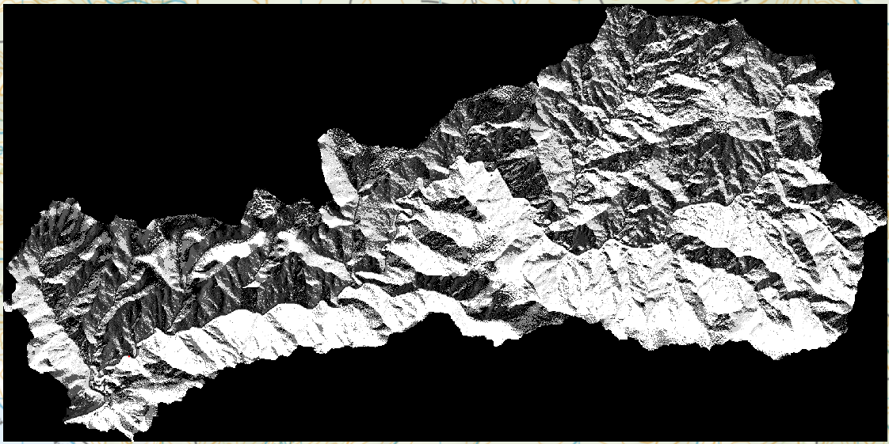

# HydroMT

HydroMT should allow us to build the required files for Wflow in a less manual
painful way.  It should be repeatable.  Online
[doco](https://deltares.github.io/hydromt/latest/) for HydroMT.

Below is an example of using HydroMT for somewhere in Northland.

## Install

Install instructions are [here](https://deltares.github.io/hydromt/v0.7.1/getting_started/installation.html) but in brief on the HPC

```
. /opt/niwa/profile/conda_24.11.3_2025.05.1.sh
conda env create -p /esi/project/niwa00004/wilkinsmc/conda_envs/hydromt
conda activate /esi/project/niwa00004/wilkinsmc/conda_envs/hydromt
mamba install "affine<3"  # this is because njit can't deal with Affine transform if affine too new
mamba install hydromt hydromt_wflow
```
and after making the above one can save out an environment yaml file for next time
```
conda env export | egrep -v ^prefix\|name > hydromt/environment.yml
```
and use it to (re)make the environment
```
. /opt/niwa/profile/conda_24.11.3_2025.05.1.sh
conda env create -yf hydromt/environment.yml -p /esi/project/niwa00004/wilkinsmc/conda_envs/hydromt
```

## Forcings

I'm not 100% sure these will be correct since I bet these NetCDFs are bottom-up
and Wflow (and normal rasters) want top-down.  But for now we are just making
some forcings to see if we can get the process going.

We don't have a temp netcdf file, so make it.  This is from daily min/max.

```
mkdir /esi/project/niwa00026/VCSN_Grids/Temp
cp /esi/project/niwa00026/VCSN_Grids/TMax_Norton/tmax_vclim_clidb_Norton_1972010200_2025060200_north-island_p05_daily_netcdf4.nc /tmp/temp.nc
ncks -A -v tmin /esi/project/niwa00026/VCSN_Grids/TMin_Norton/tmin_vclim_clidb_Norton_1972010200_2025060200_north-island_p05_daily_netcdf4.nc /tmp/temp.nc
ncap2 -O -s 'temp=(tmax+tmin)/2.0f' /tmp/temp.nc /esi/project/niwa00026/VCSN_Grids/Temp/temp_vclim_clidb_Norton_1972010200_2025060200_north-island_p05_daily_netcdf4.nc
rm /tmp/temp.nc
```

## Static files

These is mainly what I'm testing in this example.  We do want the conditioned
DEM and D8 the same size and into a single NetCDF.    We could provide our
lines too and they get burnt in, but for now just let HydroMT work it out.
Start with a fairly small box, the yaml config will restrict it further

```
XMIN=1595694
XMAX=1654656
YMIN=6076850
YMAX=6115712

rm /esi/project/niwa40004/northland_dem_hydromt_sample.tif /esi/project/niwa40004/northland_d8_hydromt_sample.tif /esi/project/niwa40004/northland_hydromt_hydrography.nc

gdal_translate \
  -projwin $XMIN $YMAX $XMAX $YMIN \
  -co TILED=YES \
  -co COMPRESS=ZSTD \
  /esi/project/niwa40004/river_network/ni.tif \
  /esi/project/niwa40004/northland_dem_hydromt_sample.tif

gdal_translate \
  -projwin $XMIN $YMAX $XMAX $YMIN \
  -co TILED=YES \
  -co COMPRESS=ZSTD \
  /esi/project/niwa40004/river_network/raster-cache-4m/d8_e396451_n1527637_w50000xh50000.tif \
  /esi/project/niwa40004/tmp.tif

# switch from my D8 format to LDD
python d8_to_ldd.py /esi/project/niwa40004/tmp.tif /esi/project/niwa40004/northland_d8_hydromt_sample.tif

gdal_translate -of netCDF -co FORMAT=NC4 -co WRITE_BOTTOMUP=NO /esi/project/niwa40004/northland_dem_hydromt_sample.tif /esi/project/niwa40004/northland_hydromt_hydrography.nc
ncrename -v Band1,elevtn /esi/project/niwa40004/northland_hydromt_hydrography.nc

gdal_translate -of netCDF -co FORMAT=NC4 -ot Byte -a_nodata 255 -co WRITE_BOTTOMUP=NO /esi/project/niwa40004/northland_d8_hydromt_sample.tif /esi/project/niwa40004/tmp.nc
ncrename -v Band1,flwdir /esi/project/niwa40004/tmp.nc

ncks -A /esi/project/niwa40004/tmp.nc /esi/project/niwa40004/northland_hydromt_hydrography.nc

rm /esi/project/niwa40004/tmp.{tif,nc}
```

HydroMT works so much better if the upstream area is available.  It means we
can specify the subbasin by giving an usarea criteria.  Generate using
```
python calc_uparea.py  /esi/project/niwa40004/northland_hydromt_hydrography.nc  --out /esi/project/niwa40004/northland_hydromt_hydrography_with_uparea.nc  --crs EPSG:2193
```


## Build

```
hydromt build wflow_sbm /esi/project/niwa40004/wflow_model -d northisland_data_catalog.yaml -i northisland_config.yaml -v
```

## Results

There are a lot of layers made for Wflow.  Here is just an example, the
river_slope.  

